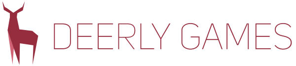

<p align="center">
<a name="top" href="https://github.com/DeerlyGames/Entry"></a>
</p>

<p align="center">
<b><a href="#overview">Overview</a></b> | <b><a href="#documentation">Documentation</a></b> | <b><a href="#license">License</a></b>
</p>

## Overview
For developers faster iteration results in more room for creativity. This project addresses two causes of slowdowns application reboots and compilation time. <br/> **Entry** is a lightweight entrypoint for applications written in C/C++ or any language that can export C style functions into dynamically loadable libraries. **Entry** is responsible for hot reloading your code giving immediate feedback.<br/>

## Documentation
### Introduction
### Functions
#### ```int Entry_Attach(const char* _dir, const char* _name, const char* _prefix, const char* _suffix)```
Attach the path of a dynamically loadable library to the system.

| Type   | Name                | Description  |
| ------ | ------------------- | ------------ |
| <code>const char*</code> | _dir | Path to Dynamic library. e.g. Compiled/ |
| <code>const char*</code> | _name | Name of Dynamic Library e.g. Main |
| <code>const char*</code> | _prefix | Prefix of DLL e.g. lib |
| <code>const char*</code> | _suffix | Suffix of DLL e.g. .so or .dll |

#### int Entry_Run()
Runs the specified entry setup. Returns 0 (Requests quit) or 1 (Keep running).
### Getting Started

    #include "Entry.h"

    ENTRY_MAIN( int argc, char* argv[] )
    {
        Entry_Attach("", "SimpleLoop");
        while (Entry_Run()) {

        }
        return 0;
    }
### Compiling

#### Visual Studio ####
Zen generates an Visual Studio Solution, for the entire software package.

```sh
    $ aemake vs2015
    $ msbuild Entry.sln
```
#### GNU Makefile ####

```sh
    $ aemake gmake 
    $ make
```

## [License](https://github.com/DeerlyGames/Entry/blob/master/LICENSE)

<a href="http://opensource.org/licenses/BSD-2-Clause" target="_blank">

</a>

    Copyright 2017 Deerly Games. All rights reserved.

	Redistribution and use in source and binary forms, with or without
	modification, are permitted provided that the following conditions are met:
	
	   1. Redistributions of source code must retain the above copyright notice,
	      this list of conditions and the following disclaimer.
	
	   2. Redistributions in binary form must reproduce the above copyright
	      notice, this list of conditions and the following disclaimer in the
	      documentation and/or other materials provided with the distribution.
	
	THIS SOFTWARE IS PROVIDED BY COPYRIGHT HOLDER ``AS IS'' AND ANY EXPRESS OR
	IMPLIED WARRANTIES, INCLUDING, BUT NOT LIMITED TO, THE IMPLIED WARRANTIES OF
	MERCHANTABILITY AND FITNESS FOR A PARTICULAR PURPOSE ARE DISCLAIMED. IN NO
	EVENT SHALL COPYRIGHT HOLDER OR CONTRIBUTORS BE LIABLE FOR ANY DIRECT,
	INDIRECT, INCIDENTAL, SPECIAL, EXEMPLARY, OR CONSEQUENTIAL DAMAGES
	(INCLUDING, BUT NOT LIMITED TO, PROCUREMENT OF SUBSTITUTE GOODS OR SERVICES;
	LOSS OF USE, DATA, OR PROFITS; OR BUSINESS INTERRUPTION) HOWEVER CAUSED AND
	ON ANY THEORY OF LIABILITY, WHETHER IN CONTRACT, STRICT LIABILITY, OR TORT
	(INCLUDING NEGLIGENCE OR OTHERWISE) ARISING IN ANY WAY OUT OF THE USE OF
	THIS SOFTWARE, EVEN IF ADVISED OF THE POSSIBILITY OF SUCH DAMAGE.
